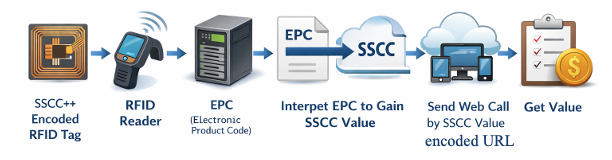

# Technical Guidance: How to Interpret SSCC++ from EPC

This document is a technical guidance of how to interpret SSCC++ for an RFID tag's EPC.

## Typical SSCC++ interpret architecuture

In a typical SSCC++ interpret data flow:

1.  SSCC++ encoded RFID tags with be deployed in the environment;

2. An RFID reader scan and read EPC from an RFID tag;

3. Interpret EPC and gain SSCC Value and Domain informaiton etc, and compose a query URL based on this information;

4. Send Web call by this URL;

5. Get Vaule from URL query. 

To host SSCC++ information, the RFID tag must support extended EPC memory. The minimum EPC length required will be: $8+1+3+72+(hostnamebits)$, which allows up to 63 characters for the hostname. In practice, this means the EPC must be between 396 and 464 bits. Most legacy 96-bit-only RFID tags cannot accommodate SSCC++ information.

## EPC Structure

Electronic Product Code (EPC) is a universal, globally unique identifier designed to uniquely identify every physical object (such as individual items, cases, pallets, or logistics units) in the supply chain.

### A general EPC structure is:

[Header][Filter][Partition][Company Prefix][Serial/Reference][Optional Data]

- **Header** — Defines the EPC type/scheme (e.g., SGTIN for items, SSCC for shipping containers).
- **Filter value** — Helps quickly filter reads (e.g., pallet vs. case vs. item).
- **Partition** — Indicates how the following bits are split.
- **Company Prefix** — Identifies the company/GS1 member.
- **Serial/Reference** — Identifies the product or specific instance.

EPC is stored in the EPC memory bank of the RFID tag. Most basic/legacy tags only have 96 bits (very common and cheapest). While Extended versions can support EPC with: 128 bits, 256 bits, up to 496 bits on advanced tags. For example, to host SSCC++ we must use 496 bits.

### SSCC++ EPC structure

**SSCC++** is an **extended EPC scheme** for encoding the **Serial Shipping Container Code (SSCC)** on RFID tags. It is part of the modern **GS1 EPC Tag Data Standard** (specifically supported in libraries and tools that implement the latest versions). The "++" indicates an enhanced version that goes beyond the traditional **SSCC-96** (which is limited to 96 bits). Its EPC structure:

[Header (8 bits)] [Toggle bit(s) / Control flags] [Filter Value (3 bits)] [SSCC-related fields] [Hostname encoding]

- **Header** — 8-bit EPC header that identifies the scheme as SSCC++ (different from the classic SSCC-96 header).
- **Toggle / Control bits** — Usually includes a flag (often called "toggle" or similar in the implementation) that indicates whether a custom hostname is present and how it is encoded.
- **Filter Value** — 3 bits (same as in most other EPC schemes: 0 = all others, 1 = pallet, 2 = case, etc.).
- **SSCC fields** — Extension digit + GS1 Company Prefix + Serial Reference (encoded similarly to SSCC-96 or SSCC+, but with variable partitioning to support longer prefixes).
- **Hostname** — Variable-length encoded string (up to 63 characters in practice). This is the key addition in the "++" schemes. It is efficiently packed (not simple ASCII) so the total EPC length stays reasonable.

#### Decoded Structure (SSCC++) exmaple

Example: EF0<mark>006141411234567890</mark>1871FA5A30C92A2A4C0

This EPC uses the modern **SSCC++** scheme (defined in GS1 EPC Tag Data Standard TDS 2.3), which supports both the full SSCC identifier **and** a custom hostname for GS1 Digital Link resolution.

| Field            | Description                                                               | Details in this Example                                                                                                                                           |
| ---------------- | ------------------------------------------------------------------------- | ----------------------------------------------------------------------------------------------------------------------------------------------------------------- |
| **Header**       | Identifies the EPC scheme                                                 | EF (binary 11101111) → SSCC++                                                                                                                                     |
| **+AIDC Toggle** | Indicates whether additional data (e.g., hostname) follows                | Enabled (1)                                                                                                                                                       |
| **Filter Value** | Used for fast population filtering (e.g., pallet vs. case)                | 000 (typically “all objects”)                                                                                                                                     |
| **SSCC Data**    | Extension digit + GS1 Company Prefix + Serial Reference (18 digits total) | 006141411234567890                                                                                                                                                |
| **Hostname**     | Custom domain for Digital Link (up to 63 characters)                      | Encoded after the SSCC portion (exact decoded string depends on the encoding method – commonly something like id.gs1.org or a branded domain in real deployments) |
| **Total Length** | Variable (depends on hostname length)                                     | 168 bits in this example (42 hex characters)                                                                                                                      |

**Key Notes for Implementation** 

- **SSCC++** is specifically designed for logistics units (pallets, containers, etc.) that require both physical identification **and** web-resolvable information via a custom hostname.
- Unlike the legacy **SSCC-96** (fixed 96 bits, header 31), SSCC++ requires **extended EPC memory** on the RFID tag. Most low-cost 96-bit-only tags cannot store it.
- Practical EPC lengths for SSCC++ typically range from **~168 bits** (short hostname) up to **396–464 bits** (longer hostnames up to 63 characters).
- The hostname is encoded efficiently (using methods such as URN Code 40 or 7-bit truncated ASCII with TLD optimizations) and placed after the SSCC data.

Then the ending URL:

https://ID.GHWPC.COM/00/006141411234567890/414/<location value representing the robot>&linkType=gs1:epcis_repository

This example demonstrates a complete SSCC++ encoding that can be programmed onto compatible RAIN RFID tags supporting extended EPC memory.

**Return Value:** It will return an json file with SGTINs

